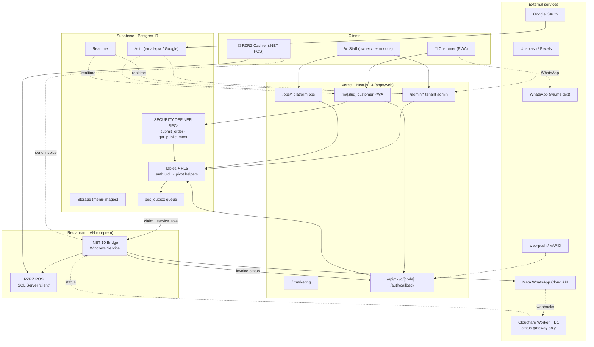
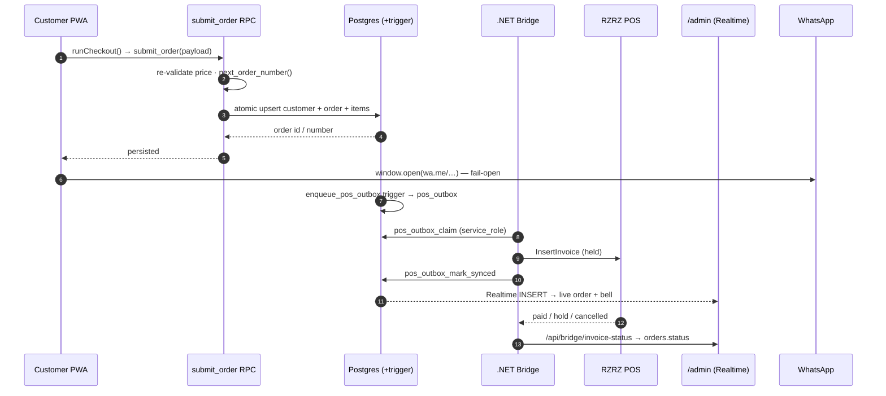

# MenuLink — Tech Stack & Technical Design

> **Scope:** the whole MenuLink platform — web app, data layer, infra, integrations, and tooling.
> **Trace date:** 2026-06-30 · **Source:** `apps/web` source, all 77 `apps/web/supabase/migrations/*.sql`,
> `bridge-app/`, `services/`, `packages/remotion-renderer`, and every package manifest (verified by a
> parallel multi-agent code sweep, not from memory). Where an older doc disagrees with the code, the
> code wins — see [§8 Honest gaps & stale-doc corrections](#8-honest-gaps--stale-doc-corrections).
> **Companion docs:** [`auth-rls-bridge-trace.md`](./auth-rls-bridge-trace.md) (RLS deep-dive) ·
> [`system-design.html`](./system-design.html) · [`../pos/POS-STATE.md`](../pos/POS-STATE.md) (POS bridge).

**What it is:** a multi-tenant, Arabic-first SaaS for Saudi restaurants — digital menu + WhatsApp
ordering + loyalty + a per-tenant design studio, with an optional POS / WhatsApp-invoice integration.
~10 restaurants / 8 businesses live, all on **Vercel + Supabase**, with **no custom server**.

---

## Table of contents

- [System at a glance (diagrams)](#system-at-a-glance)

1. [Tech stack](#1-tech-stack)
2. [Repository shape](#2-repository-shape)
3. [The four surfaces](#3-the-four-surfaces-one-app)
4. [Rendering & app architecture](#4-rendering--app-architecture)
5. [Data layer & multi-tenancy](#5-data-layer--multi-tenancy)
6. [Auth model](#6-auth-model)
7. [Cross-cutting subsystems](#7-cross-cutting-subsystems)
8. [Honest gaps & stale-doc corrections](#8-honest-gaps--stale-doc-corrections)

---

## System at a glance

**Component / deployment view** — clients, the single Next.js app, Supabase, the on-prem POS bridge, and external services:



**Order placement (sequence)** — the dual-write to Supabase + WhatsApp, then the async POS bridge:



---

## 1) Tech stack

### Frontend / App (`apps/web` — the only deployed surface)

| Tech | Version | Role |
|---|---|---|
| **Next.js** (App Router) | `^14.2.35` | Core framework. RSC for data fetching, Route Handlers for APIs, Server Actions for mutations. |
| **React / React-DOM** | `^18.3.1` | UI; `'use client'` islands for all interactivity. |
| **TypeScript** | `^5.5.3` (strict) | Whole app; `@/*` path alias, `moduleResolution: bundler`. |
| **Tailwind CSS** + PostCSS + autoprefixer | `^3.4.6` | Styling; per-tenant palette delivered via **CSS variables**, not Tailwind config. |
| **chart.js** + react-chartjs-2 | `^4.5.1` / `^5.3.1` | Admin/ops analytics (revenue line + orders bar, RTL tooltips). |
| **leaflet** + leaflet-draw | `^1.9.4` / `^1.0.4` | Delivery-zone editor (radius circle / freehand polygon → GeoJSON, CARTO tiles). |
| **qrcode** | `^1.5.4` | Menu / table / Google-review QR posters. |
| **sharp** | `^0.34.5` | Server-side image optimize (resize → WebP q80 before upload). |
| **exceljs** | `^4.4.0` | Tier-2 styled XLSX exports (orders + customers, formula-first). |
| **web-push** | `^3.6.7` | Self-hosted Web Push (VAPID). **This is the real push stack — not OneSignal.** |
| Google Fonts (CDN) | — | Tajawal / Cairo / Plus Jakarta / Anybody + per-theme display fonts. |

### Backend / Data

| Tech | Role |
|---|---|
| **Supabase (Postgres 17)** | The entire backend — DB + Auth + RLS + Realtime + Storage. Project ref `dhmjrrsynfvomlzhggvu` (Singapore, `ap-southeast-1`). |
| **`@supabase/ssr` `^0.5.1` + `supabase-js` `^2.45.0`** | Three client tiers (see [§5](#5-data-layer--multi-tenancy)). |
| **PostgREST RPCs** (SECURITY DEFINER) | The only read/write path for the anonymous customer role. |
| **PL/pgSQL triggers · pgcrypto · pg_cron** | Automation: JWT-claim mirroring, payment→activation, loyalty earn, POS outbox enqueue, 90-day PDPL retention purge. |

### Infra / Hosting

- **Vercel**, two projects, auto-deploy on push to `main`:
  - `menulink-admin-five` → the Next.js app (marketing + `/m` + `/admin` + `/ops`).
  - `menulink-eight` → legacy v6 static PWA, now just **302-redirects** old QR/links (repo-root `vercel.json`).
- **No CI** (`.github/` does not exist). Schema migrations are applied to prod **manually via the Supabase Management API** (Personal Access Token), *not* `supabase db push`.

### External integrations

Google OAuth (customer sign-in, via Supabase) · Unsplash + Pexels (admin photo search / catalog gap-fill) ·
**Meta WhatsApp Cloud API** (digital-invoice bridge) · **Cloudflare Workers + D1** (WhatsApp status gateway only) ·
RZRZ / Punnelifosys POS (.NET Framework 4.7.2 WinForms + SQL Server).

### Auxiliary packages (not part of the deployed web app)

- **`packages/remotion-renderer`** — standalone **Remotion 4** (`^4.0.469`) offline MP4 pipeline (item spotlights, promos, tutorials) + **Playwright** `^1.61` (screen capture) + **msedge-tts** `^2.0` (Arabic voiceover). Explicitly *not* a dependency of `apps/web`.
- **`bridge-app`** — **.NET 10 Windows Service** (the POS order-push bridge; also co-hosts the WhatsApp sender).
- **`scripts/catalog/*.mjs`** — loose Node ESM photo-catalog tooling (borrows deps from `apps/web/node_modules` by absolute path).

---

## 2) Repository shape

**Not a formal monorepo** — there is no root `package.json`, no `pnpm-workspace.yaml`, no `turbo.json`/`lerna.json`.
It is a set of loosely-coupled, independently-installed folders, each with its own `node_modules` + lockfile:

```
D:\menulink\
├── apps/web/                 ← Next.js 14 SaaS — the ONLY Vercel-deployed surface
├── bridge-app/               ← .NET 10 Windows Service (POS bridge)
├── services/                 ← Cloudflare Worker (WhatsApp status gateway)
├── packages/remotion-renderer/ ← standalone Remotion video pipeline (offline)
├── scripts/ + scripts/catalog/ ← Node ESM tooling (photo catalog, per-tenant one-offs)
├── docs/                     ← architecture, POS, strategy, proofs
├── archive/legacy-pwa/       ← v6 static PWA (now redirects)
└── vercel.json               ← the only root config (legacy 302 redirects)
```

The only root-level config is `vercel.json`. `apps/web` is the single build target Vercel deploys.

---

## 3) The four surfaces (one app)

A single Next.js codebase serves everything, routed by URL:

| Surface | Path | What it is |
|---|---|---|
| **Marketing** | `/` | Arabic/RTL landing (static RSC): hero, features, pricing, WhatsApp CTA. |
| **Customer PWA** | `/m/[slug]` | The big surface — menu, cart, checkout, account, loyalty, orders, notifications. |
| **Tenant Admin** | `/admin/*` | Owner/team console — menu CRUD, live orders, customers/RFM, loyalty, branches, drivers, zones, tables, reports, POS, QR. |
| **Platform Ops** | `/ops/*` | Platform back-office — onboard tenants, log payments, cross-tenant analytics, per-tenant **Design Studio**. |

Plus two utility routes: **`/print/[slug]/[size]`** (printable menus/posters) and **`/q/[code]`** (QR short-link resolver that records the scan then 302-redirects).

---

## 4) Rendering & app architecture

- **RSC-first.** Pages/layouts are Server Components and do all Supabase fetching server-side (often `Promise.all` of an RPC + table reads). Interactivity lives in sibling `'use client'` files (`*-client.tsx`, `*-form.tsx`, `*-editor.tsx`) receiving server data as props.
- **Mutations** are either **Server Actions** (`actions.ts` under `/ops` & `/admin`) or **browser-Supabase RPC calls** from event handlers.
- **`force-dynamic` on data routes** (`/m/[slug]`, `/print/...`) so every render reflects live edits and fires visit logging. This is a deliberate **"no caching/ISR"** tradeoff — each `/m/[slug]` hits the DB per request. Only the per-tenant manifest route is cached (5 min).
- **Middleware** (`middleware.ts`, matches `/admin/*` + `/ops/*` only): refreshes the Supabase auth cookie on every request (sessions otherwise expire ~1h) and injects an `x-pathname` header so RSC layouts can read the current path.

### End-to-end order flow (the canonical path)

```
menu-experience.tsx (cart state, localStorage-hydrated)
  → checkout-core.ts  runCheckout()
       ├─ open_table_session()          (only if scanned ?table=)
       ├─ submit_order RPC              (PERSIST: re-validate price server-side,
       │                                 next_order_number(), atomic customer-upsert
       │                                 + order + items, optional points redemption)
       └─ window.open("wa.me/…")        (SIMULTANEOUSLY fire a WhatsApp text)   ← dual nature
  → enqueue_pos_outbox trigger          (snapshot order+customer+items into pos_outbox)
  → Bridge App  pos_outbox_claim        (.NET service, service_role key, FOR UPDATE SKIP LOCKED)
       → RzrzPosAdapter  InsertInvoice  (writes a HELD invoice into the POS)
  → admin/orders Realtime feed          (live, with a Web-Audio bell)
  → /api/bridge/invoice-status          (POS reports paid/hold/cancelled → orders.status)
```

**Key design facts:**
- **No online payment.** The order is *persisted* (Supabase) **and** *sent* as a WhatsApp message; the customer pays in-store / on-delivery. WhatsApp open is **fail-open** (it fires even if Supabase is unreachable).
- **VAT is inclusive:** `vat = amount × 15 / 115`, never added on top. `checkout-core.ts` is the single source of truth for turning a cart into both the WhatsApp message and the `submit_order` payload.

---

## 5) Data layer & multi-tenancy

The data layer is a single-database multi-tenant Supabase Postgres schema, built as **77 ordered SQL migrations** (`0001…0077`) plus `seed.sql` and `config.toml`.

### Multi-tenancy = `restaurant_id` everywhere

Every tenant-scoped table carries `restaurant_id` (or reaches it via a parent) and cascades on tenant delete. `restaurants` is the tenant root and the **bridge** between the core data model and the auth subsystem. Note: `customers` are **per-tenant** (`unique(restaurant_id, phone)`), not global — one phone can exist at many tenants.

### RLS + the SECURITY DEFINER helper pattern (the backbone)

RLS is enabled on every table. Authorization is derived from `auth.uid()` against pivot tables via **STABLE SECURITY DEFINER helpers** (so policies never recurse and never trust client-supplied ids or JWT claims):

- `is_platform_admin()` → `platform_admins`
- `owns_restaurant(uuid)` / `owns_restaurant_text(text)` → `restaurant_owners`
- `has_restaurant_access(uuid)` / `has_branch_access(uuid)` / `get_admin_role(uuid)` → `restaurant_admins` (+ branch scope)

> **The defining war story (migration 0008):** the original `0001`/`0003` policies read `auth.jwt() ->> 'restaurant_id'`, but Supabase nests real claims under `app_metadata`, so the path silently returned **NULL** — every authenticated query fell through (zero rows / rejected inserts), while plain analytics views leaked cross-tenant. `0008` dropped all claim-based policies and rebuilt them on `auth.uid()` + pivot lookups. Every later migration reuses this pattern. Full trace: [`auth-rls-bridge-trace.md`](./auth-rls-bridge-trace.md).

> **Migration 0071 (tenant-isolation hardening):** a security-audit pass that closed 6 real leaks — analytics views that bypassed RLS (now self-filter by `has_restaurant_access()`/`is_platform_admin()`, anon SELECT revoked), `get_tenant_owners` trusting a JWT role claim, `pos_outbox` RPCs callable by any authenticated user (now `service_role`-only), a `with check (true)` heartbeat insert, and missing `is_active` guards. Applied + smoke-tested live.

### Anonymous access = RPC-only

The `anon` role has almost no direct table privileges; it is granted EXECUTE on SECURITY DEFINER RPCs which **are** the security boundary:

- **`get_public_menu(slug)`** — returns the whole denormalized menu (incl. SFDA nutrition, `name_en`, `google_review_url`) only for `is_active AND is_published` tenants.
- **`submit_order(jsonb)`** — atomically upserts customer + inserts order + items in one round-trip. Hardened over time: server-side **price re-validation** (looks up real `menu_item_variants.price`, rejects under-pricing, caps modifier delta at 30 SAR), branch resolution, race-safe per-branch **business-day order numbering** (`pg_advisory_xact_lock`), and atomic **points-as-currency redemption**.
- Other anon RPCs: `mark_arrived`, `open_table_session`/`get_table_session`/`request_table_checkout`, `resolve_qr_link`, `get_published_design`, `get_active_promotions`, `log_menu_view`, `auto_link_customer`, `link_customer_account`.

### Three Supabase client tiers (distinct trust boundaries)

| Client | Key | Used for |
|---|---|---|
| `lib/supabase-server.ts` | anon + auth cookies | Server Components, Route Handlers, Server Actions — **RLS-enforced as the logged-in user**. Nearly every `/api` route. |
| `lib/supabase-browser.ts` | anon, no cookies | `'use client'` Realtime subscriptions + client-side mutations. |
| `lib/supabase-admin.ts` | **service_role** | Server-only, **bypasses RLS**. Reserved for platform-admin cross-tenant writes + Auth Admin API (creating tenant users). |

### Automation via triggers

- **Payment → subscription → publish (`0005`):** an INSERT into `payments` fires `apply_payment_to_subscription()` → extends `current_period_end` (⚠️ **stacks onto an unexpired period** — the documented period-stacking gotcha), flips status `active`, republishes the restaurant. Overdue/cancelled auto-unpublishes.
- **Loyalty earn:** a separate `z_loyalty_after_insert` trigger (the `z_` forces it to fire *after* the aggregate-updating trigger), wrapped in `EXCEPTION WHEN OTHERS → RAISE WARNING` so a loyalty bug can never block an order insert. `loyalty_transactions` is a signed append-only ledger.
- **JWT-claim mirroring:** `refresh_user_app_metadata()` writes `role`/`restaurant_id`/`team_role` into `app_metadata` (precedence: platform_admin > owner > admin). For the app/UI only — **RLS itself relies on `auth.uid()` helpers, not these claims**.

### Storage & Realtime (narrow on purpose)

- **One** Storage bucket: `menu-images` (public, 5 MB, jpeg/png/webp, path-prefix RLS by `<restaurant_id>/` folder).
- The `supabase_realtime` publication carries only `pos_outbox`, `loyalty_redemptions`, `table_sessions`, `push_broadcasts`.

### SFDA compliance baked in (`0024`)

`menu_items` carry `calories_kcal` / `sodium_mg` / `caffeine_mg` / `allergens_json` (14 mandatory allergens), variants carry per-variant calories; surfaced by `get_public_menu` and rendered in the PWA (reflecting the Saudi digital-menu nutrition mandate).

---

## 6) Auth model — two distinct worlds

- **Staff** (owner / team / ops): **email + password** (`signInWithPassword`); role lives in `app_metadata`; `lib/auth.ts` guards (`requireOwner` / `requireAdmin` / `requireOps`) `redirect()` by role (platform_admin → `/ops`, owners → `/admin`).
- **Customers**: **Google OAuth** (`/auth/callback` exchanges the code for a session) **or** a guest identity stored in `localStorage` (`menulink:guest`). `customer-shell.tsx` resolves auth state and gates order-type selection.

Principals that cross the tenant boundary: **owner** (`restaurant_owners`), **team admin** (`restaurant_admins` + branch scope), **platform admin** (`platform_admins`, cross-tenant), **customer** (`customers.auth_user_id`), **anon** (slug for reads, client-supplied id validated inside RPCs), **bridge_service** (service_role key, bypasses RLS).

---

## 7) Cross-cutting subsystems

### Per-tenant theming / Design system (the product's signature)

Theme is resolved in layers per slug: `getTheme(slug)` → `buildCssVars()` → overlay a DB-**published** design profile (`get_published_design` RPC, via `lib/design/*`) → `restaurants.menu_design_key` is **authoritative** if set (decouples design from slug). The resolved `menuLayout` dispatches a **bespoke full-page component**:

| `menuLayout` | Component | Look |
|---|---|---|
| `card-grid` | `menu-experience.tsx` | Full ordering experience (default). |
| `heritage-list` | `heritage-list-menu.tsx` | Emerald vertical list, ornamental dividers, bilingual (Mazaj, Coffee Secret). |
| `wadi-lounge` | `wadi-lounge-menu.tsx` | Near-black + ornate gold, Arabesque cards, hexagonal price badges, «معسّل» shisha badge, Google-review QR banner. |
| `premium-epicurean` | `premium-epicurean-menu.tsx` | Dark/gold fine-dining, glass top bar, full-bleed hero. |
| `display_only_mode` | Wadi/Heritage/DisplayOnly | Menu with **no cart**. |

The **Ops Design Studio** (`/ops/tenants/[id]/design`, a 7-tab console) is the authoring side over a `template → tenant-profile → export` schema (`restaurant_design_profiles`, `menu_page_templates`, `qr_*`, `promotions`…), whose published output feeds `/m/[slug]` theming **and** the `/print` posters.

### Addon / feature-gating & billing

- **`addon_catalog` + `subscription_addons`** = per-tenant feature flags (`loyalty`, `tables_qr`, `pos_bridge`, `google_review`, `multi_branch`, `drivers`, `delivery_zones`, `push_marketing`, `notification_center`, `advanced_reports`…) with `trial_ends_at` expiry. `lib/addons.ts` gates the admin sidebar nav, page guards (`notFound()`), API route 403s, and customer-side soft-degrade.
- **Billing:** subscriptions default `pending_payment`; a **manual `payments` INSERT** in `/ops` activates them. Collection is out-of-band (mada / bank transfer / cash); **the Moyasar gateway is deferred/unbuilt**.

### POS & WhatsApp-invoice bridges (the "moat")

Two independent optional layers onto Samer's RZRZ POS (.NET 4.7.2 WinForms + SQL Server DB `client`):

1. **Order-push bridge — SHIPPED, in production on RzRz Bukhari.** Transactional **outbox** pattern: Postgres trigger `enqueue_pos_outbox()` snapshots the order into `pos_outbox` (idempotent `unique(restaurant_id, order_id)`); the .NET 10 Windows Service polls/claims rows with the `service_role` key (`pos_outbox_claim` / `_mark_synced` / `_mark_failed`, `FOR UPDATE SKIP LOCKED`), maps items via `pos_item_map`, and calls `InsertInvoice` (held by default — staff tap Pay in the cashier UI). Liveness via `bridge_heartbeats`; status writeback via `/api/bridge/invoice-status`. ⚠️ Per-order `InvoiceType` differentiation is built but **parked** (changing types in the cashier UI triggers a workflow popup loop — gated on a Samer .NET patch).
2. **Background WhatsApp digital-invoice bridge — code-complete, gated on Meta verification.** The POS Helper DLL drops an atomic JSON spool job → the Bridge imports it into a local SQLite outbox → renders the committed invoice headlessly (**QuestPDF**, reusing the persisted **ZATCA** QR) → sends **direct to the Meta WhatsApp Cloud API**. A **Cloudflare Worker + D1** acts *only* as a status/webhook/24h-window gateway (signed installation auth, monotonic status upsert) — **never the send path**. ⚠️ This subsystem lives largely on branch `feat/background-whatsapp-invoice-2`, **not `main`**. See [`../pos/POS-STATE.md`](../pos/POS-STATE.md).

### Visit / QR tracking (`0077`)

`log_menu_view` runs server-side on every `/m/[slug]` open: filters bots/link-preview UAs, skips `?qr=1` (already counted by `/q/[code]`), and stores only `sha256(ip | ua | riyadh-date)` (no raw IP) bucketed to the Asia/Riyadh calendar day. `v_tenant_engagement` reports `total_views` and the honestly-named **`device_days`** (distinct device×day, *not* unique people, due to carrier NAT). `pg_cron` purges rows > 90 days for PDPL.

### PWA bits

`public/sw.js` (versioned) = **network-first for HTML** (no stale-deploy trap), cache-first stale-while-revalidate for static assets, passthrough for WhatsApp/Supabase/maps/`submit_order`. `pwa-bootstrap.tsx` registers the SW and shows a soft "add to home screen" prompt after 20s engagement (7-day dismissal). Per-tenant `manifest.webmanifest` route.

### i18n / RTL

Whole app is **RTL Arabic-first** (`<html lang=ar dir=rtl>`, Arabic-Indic digits). `lib/i18n/*` is a cookie-based `ar`/`en` dictionary used mainly by the `/ops` console; customer + admin surfaces are Arabic-only (some themes render `name_en` under `name_ar`).

---

## 8) Honest gaps & stale-doc corrections

Verified against the live tree — worth knowing before relying on older docs:

- **Stale decisions in `CLAUDE.md`:** it lists *"Push: OneSignal"* and *"Auth: OTP via SMS (Unifonic)"* — **neither was ever built.** Real push = self-hosted **web-push / VAPID**; real auth = email+password (staff) + Google OAuth (customers). No OTP / Unifonic code exists in `apps/web`.
- **No automated tests** in `apps/web` (zero unit/integration/e2e). Given `submit_order`'s price-validation and loyalty-redemption logic, the RPC layer is untested. (Only the Cloudflare worker and the .NET bridge have tests.)
- **No CI/CD pipeline** (`.github/` absent). Migrations applied by hand via the Management API; **prod is the only real environment** (the only "test" target is a data-level clone tenant, `rzrz-bukhari-test`, not separate infra).
- **No rate-limiting / bot protection** on the anon RPCs (`submit_order`, `log_menu_view`, `open_table_session`, `resolve_qr_link`). Middleware covers only `/admin` + `/ops` — `/m`, `/q`, `/api` are unguarded. A real spam-order / DoS vector.
- **No web-app observability** (no Sentry, no structured logging, no metrics) — only implicit Vercel logs. (The bridge has Serilog; the worker has `webhook_events`.)
- **Billing collection is manual** — addon *gating* is automated, but the 59 SAR/mo subscription money is recorded by hand in `/ops`; no payment gateway.
- **Security posture:** real secrets are committed in `apps/web/.env.local` and the repo is/was public — a credential rotation (service_role, owner passwords) was done, but secrets remain in **git history** (no BFG/filter-repo scrub).
- **`force-dynamic` everywhere = no caching/ISR:** every `/m/[slug]` render hits Supabase per request (intentional, for visit logging + live edits) — a deliberate cost/perf tradeoff.
- **Split bridge auth:** `/api/bridge/*` runs under a *user session* (returns 401), while the bridge service itself uses the `service_role` key for RPCs.
- **Backup/DR** relies entirely on Supabase managed backups.
